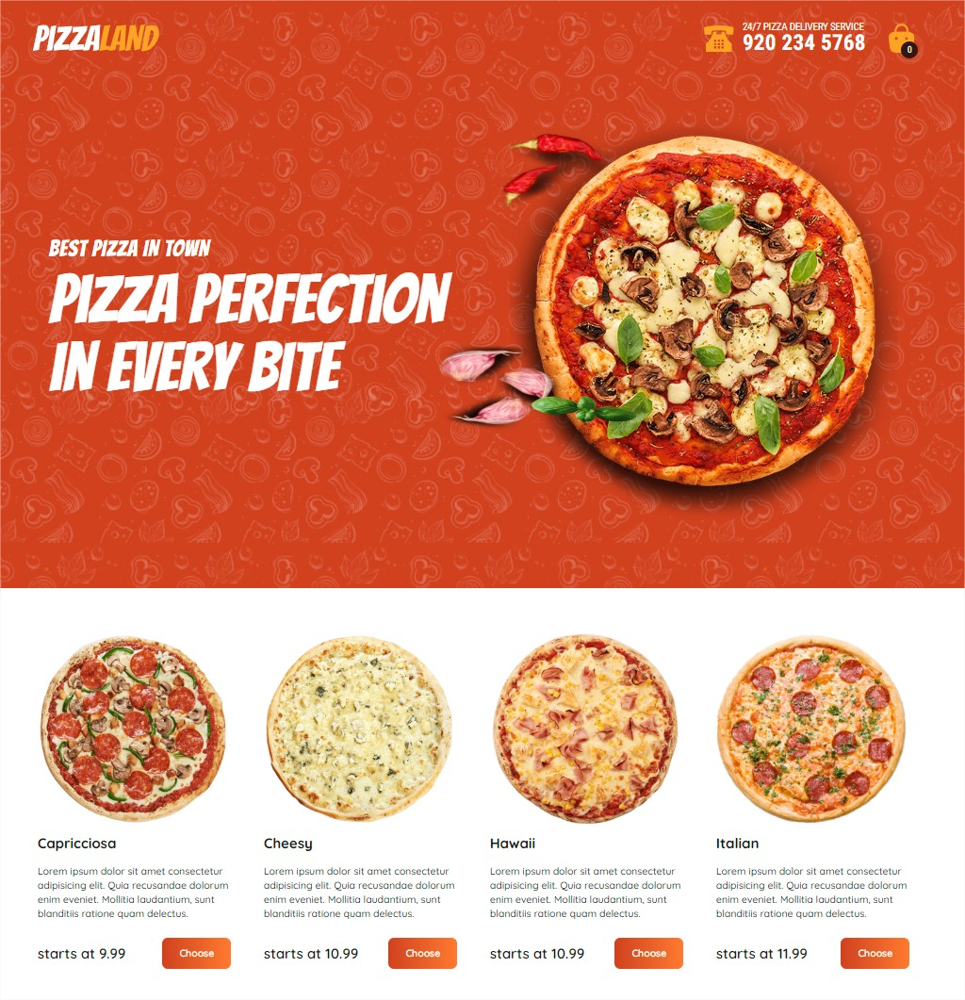
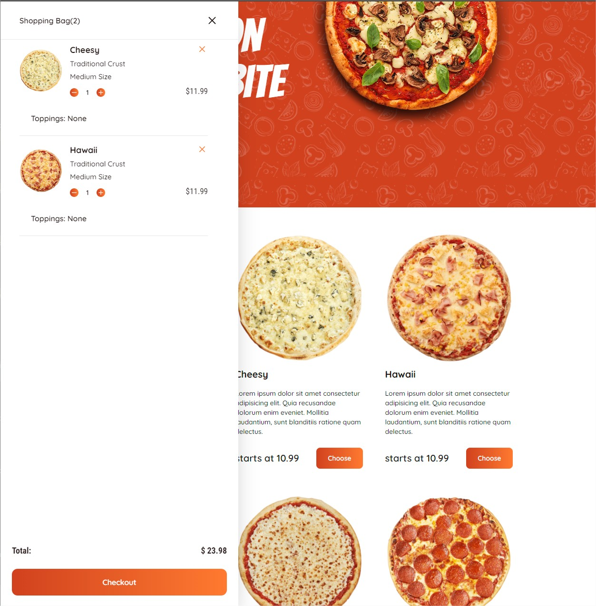
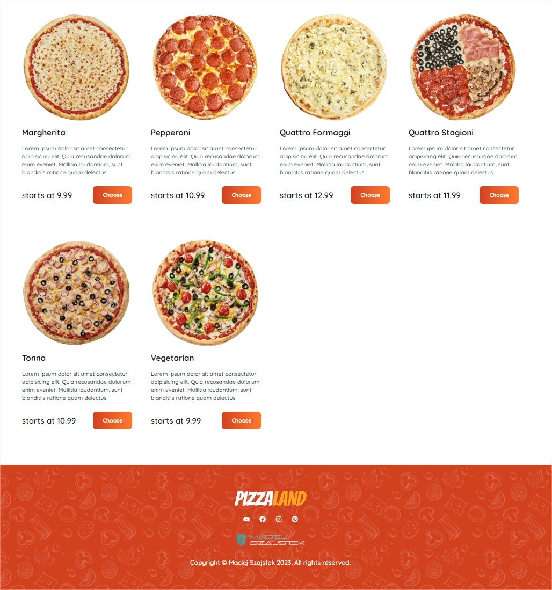
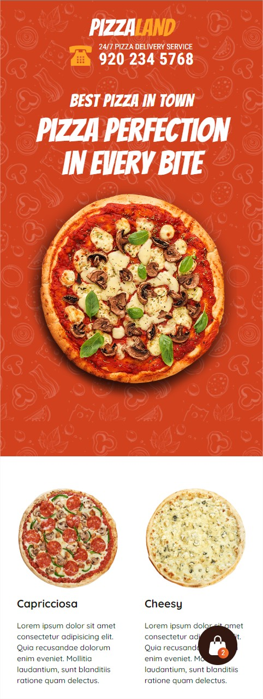
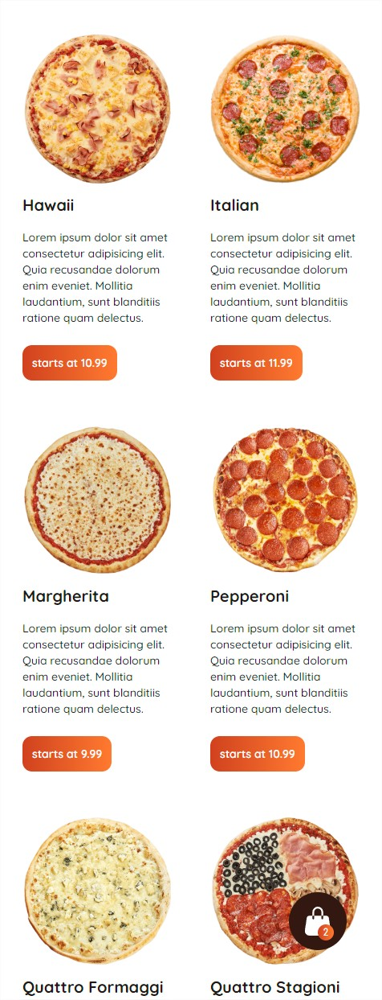
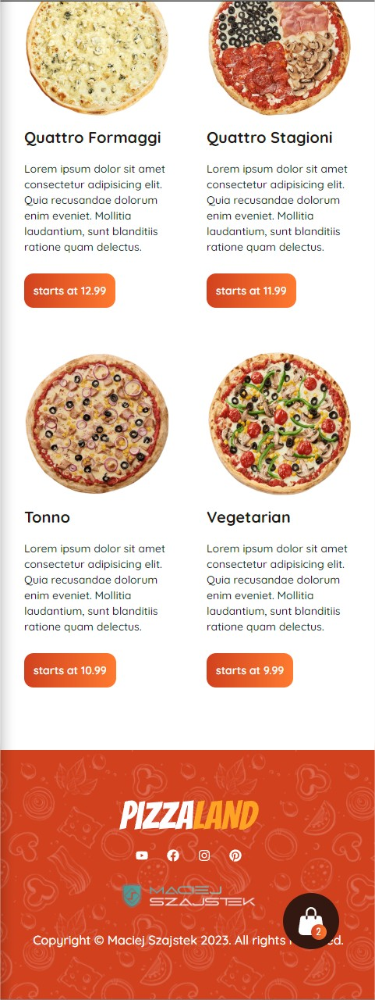

# Welcome to PizzaWorld: Your Go-To Destination for Delightful Pizza Delivered to Your Doorstep

**PizzaWorld**is your ultimate online destination for the pizza enthusiast in you. We offer a delectable variety of high-quality pizzas with a wide range of toppings and flavors, catering to both casual pizza lovers and those with a more refined palate. 

**PizzaWorld** is your ultimate online destination for the pizza enthusiast in you. We offer a delectable variety of high-quality pizzas with a wide range of toppings and flavors, catering to both casual pizza lovers and those with a more refined palate.

**Explore the Best:** Dive into our curated collection of mouthwatering pizzas, crafted with the finest ingredients and a commitment to culinary excellence. Whether you prefer classic Margherita, meaty delights, or vegetarian options, PizzaWorld has something for everyone.

**Expert Recommendations:** Our team of pizza connoisseurs is here to provide personalized recommendations, helping you choose the perfect pizza to satisfy your cravings and taste preferences.

**Secure Ordering:** Order with confidence, knowing that PizzaWorld offers secure payment options, reliable delivery, and a hassle-free return policy in case you're not completely satisfied with your pizza experience.

**Join Our Pizza Community:** Become a part of our thriving pizza community, where you can engage in discussions, share your favorite pizza creations, and gain insights from fellow pizza enthusiasts to elevate your pizza enjoyment.

## Features

* Navigation on bar
* Cart
* DataBase
* ContextCart
* Mause Parallel

## Technologies
* Next JS
* React Scroll
* React Switch
* Tailwind css
* RWD
* Typescript
* React: react-router
* Data Typescript
* Custom hook
    - useState
    - useEffect
    - useContext
    - useParams
* Responsive design
* Animations

## Demo <a href = "https://atlon1.github.io/food-del/"> here --></a>

## Desktop

## Main section

 

## Cart section
  

## Bottom section

## Mobile

## Main section

 

## Prerequisites
* Before getting started, make sure you have the Node.js and npm or yarn
* Clone this repository to your local machine
* Navigate to the project directory
* Install the project dependencies by running npm install or yarn install
* Start the development server npm start or yarn start
* Bash on folder Api to run strapi
* Open your browser and visit your localhost:3000 to see the running application.